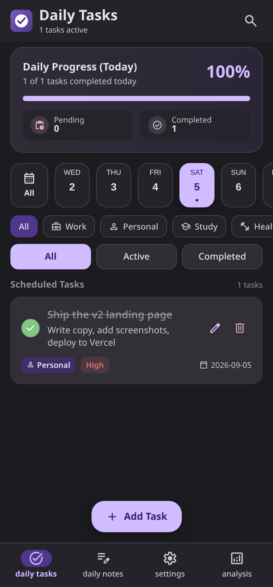

# Task Manager (Web)

A faithful web port of the **Task Manager** Android app — built with React, Vite, and a Material 3
design system. It is a **Progressive Web App (PWA)**: fully offline, installable on any device
(Android, iOS, Windows, macOS, Linux), and deployable to Vercel as a static site.

All data is stored **locally in your browser** (IndexedDB) — nothing is sent to any server. It's 100%
offline & private, just like the original app.



## Features (mirrors the Android app)

- **Daily Tasks** — today's progress card, a 14-day date selector (3 days past → 10 days ahead, plus "All"),
  category filter chips (Work / Personal / Study / Health / Shopping / Other), All / Active / Completed
  status tabs, task search, and task cards with completion toggle, edit, and delete.
- **Task editor** — title, description, due date (Today / Tomorrow presets + custom `YYYY-MM-DD`), optional
  time, priority (Low / Medium / High), category, and "Every day of month" scheduling that creates the
  task for all days of the selected month.
- **Daily Notes** — search, All / Today filter, pinned-notes section, 6-color accent palette, note dates,
  and full edit / delete support.
- **Settings** — Dark / Light / System theme (same "Elegant" purple Material 3 palette as the Android app),
  GitHub repo card, Clear Completed Tasks, Reset All Data.
- **Analysis** — today's progress, month-to-date progress with daily activity bars, category distribution,
  notes-written counter.
- **Backup & migration** — export all data as JSON (copy to clipboard or share), import JSON with
  Merge / Replace modes. The JSON format is **identical to the Android app's backup format**, so backups
  are interchangeable between the two.

## Run locally

Requires Node.js 18+.

```bash
npm install
npm run dev        # http://localhost:5173
```

Production build + local preview:

```bash
npm run build      # outputs to dist/
npm run preview    # serves the production build
```

## Deploy on Vercel

The build output is a plain static site, so deployment is trivial:

1. Push this folder to a GitHub/GitLab repository.
2. Go to [vercel.com/new](https://vercel.com/new) and **Import** the repository.
   Vercel auto-detects **Vite** — no configuration needed (build command `npm run build`,
   output directory `dist`).
3. Click **Deploy**. You're done.

You can also deploy from the CLI:

```bash
npm i -g vercel
vercel            # follow the prompts (choose Vite preset)
vercel --prod
```

Vercel serves over HTTPS automatically, which is required for PWA installation.

## Install on any device (PWA)

Once deployed (or served over HTTPS locally via `vite preview`):

- **Android (Chrome):** open the site → tap the ⋮ menu → **"Add to Home screen"** / **"Install app"**.
- **iOS (Safari):** open the site → tap **Share** → **"Add to Home Screen"**. It installs as an
  app-like icon (apple-touch-icon is included).
- **Desktop (Chrome/Edge):** click the install icon in the address bar.

The service worker precaches the app shell, so it works fully offline after the first visit.

## Project structure

```
src/
  types.ts            # data models & enums (mirror the Android Room entities)
  db.ts               # IndexedDB persistence (the web stand-in for Room)
  backup.ts           # JSON export/import (compatible with the Android backup format)
  store.tsx           # global state + actions (mirrors TaskViewModel)
  icons.tsx           # Material Symbols icons from the subset font
  components/         # cards, dialogs, date selector, etc.
  screens/            # Daily Tasks, Daily Notes, Settings, Analysis
  index.css           # Material 3 design system (Elegant dark/light palettes)
scripts/
  subset-icons.mjs    # builds the tiny icon font (subset of Material Symbols)
  gen-icons.mjs       # renders PWA PNG icons
  smoke-test.mjs      # headless end-to-end smoke test
```

## Testing

```bash
npm run build && npm run preview   # serve dist/ on a port
node scripts/smoke-test.mjs http://127.0.0.1:4173
```

The smoke test drives the app in headless Chromium: creates a task, toggles completion, verifies
persistence across reload, creates a pinned note, and checks the Analysis and Settings screens.